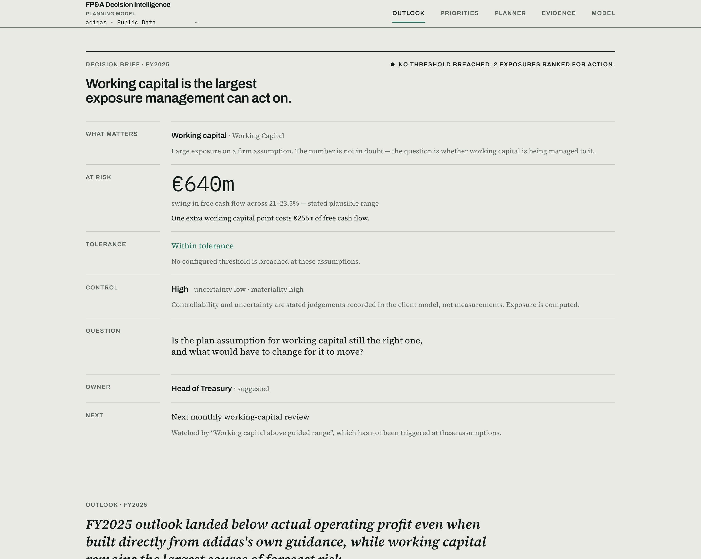
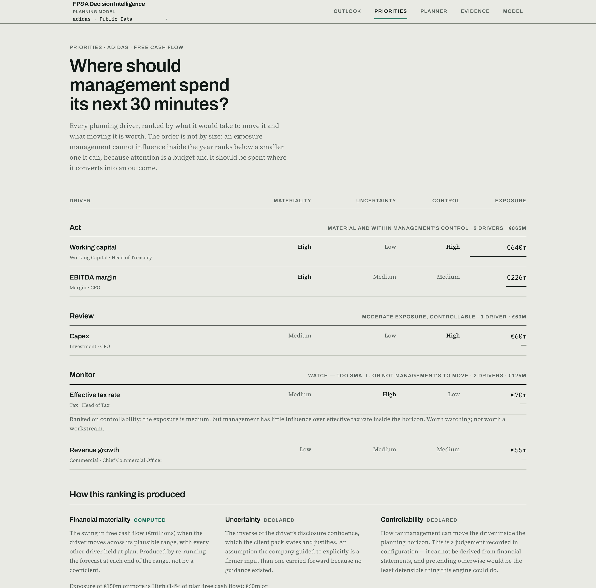
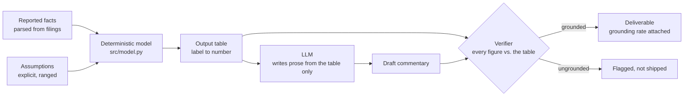

# FP&A Decision Intelligence Accelerator

**A configurable decision-support accelerator that turns planning assumptions
into quantified financial exposures, ranked management priorities and
traceable actions.**

### [▶ Open the live accelerator](https://fpa-decision-intelligence.vercel.app)

Start on **Priorities** for the argument in one screen, or switch the planning
model in the top-left from *adidas · Public Data* to *Manufacturing · Synthetic
Demo* to see the same engine driven by a different business.

> The API sleeps on its free tier, so the first page load after a quiet period
> takes about a minute while it wakes. Subsequent loads are immediate.



## The problem

FP&A review cycles reliably produce analysis. They much less reliably produce
decisions. A forecast pack lands, the variances are explained, the sensitivity
table is admired — and the meeting ends without anyone naming which exposure
is worth the next thirty minutes, who owns it, or what would have to change
for the answer to move.

The gap is not analytical rigour. It is that the analysis stops one step short
of the decision, and the step it stops short of is the one that requires
judgement about what management can actually influence.

## The concept

Carry the chain all the way through:

```text
financial data → forecast → uncertainty → financial exposure
              → management priority → decision → action
```

Everything left of *exposure* is arithmetic and this project computes it.
Everything right of it needs stated judgement, so this project makes that
judgement configuration — declared per client, visible in the interface, and
labelled as judgement rather than dressed up as a measurement.

## Workflow

**Configure** the business model and its planning drivers →
**Predict** with a deterministic forecast →
**Stress** it against scenarios and disclosed uncertainty →
**Prioritize** by what is material, unresolved and movable →
**Act** on a named question with a named owner and a review trigger.

## Public demonstration: adidas AG

The first demonstration client is built entirely from adidas's published
annual reports. Nothing is invented: where the company does not disclose
something, the model says so rather than filling the gap. The EBITDA margin is
back-solved from the operating-profit guidance and labelled as derived; the
tax rate is carried forward from the prior year and labelled as the weakest
assumption in the model; adidas does not report free cash flow at all, so it
is constructed the same way for actuals and forecasts and that construction is
stated.

The forecast is backtested against what actually happened, on **two vintages**:
FY2023→FY2024 and FY2024→FY2025. Each uses the *initial* guidance from the
prior year's report, never a figure revised part-way through the year it
describes — the FY2024 report's own targets column is labelled "As published on
October 15, 2024", which would be testing the model on information it could not
have had.

### What two points showed that one could not

| Error vs. actual | FY2023 → FY2024 | FY2024 → FY2025 |
|---|---:|---:|
| Revenue | **−5.0%** vs naive −13.9% | **+3.1%** vs naive +5.5% |
| Operating profit | **−62.6%** vs naive −84.8% | **−14.9%** vs naive −22.3% |
| Free cash flow | **−54.7%** vs naive −72.2% | **−3.4%** vs naive +14.8% |

The driver-based forecast lands closer on all six metric-year pairs. That is a
statement about a weak baseline, not about accuracy: a −62.6% miss beats a
−84.8% miss and both are badly wrong.

**The second vintage's first job was to break something.** Every vintage
carries the prior year's effective tax rate forward, because adidas never
guides tax. Applied to FY2023 that gave a FY2024 plan built on a **189.2%** tax
rate — tax expense on a near-zero pre-tax result in the write-off year. It is
not a conservative assumption, it is a meaningless one, and it cost the
free-cash-flow forecast 32 points of error on its own, which made the method
look worse than a naive extrapolation on cash.

The rule is now guarded: a rate outside 10–45% falls back to the median of the
rates *already published at the time*, never a later year. For FY2024 that is
FY2022's 34.5% — **higher** than the 26.5% FY2024 actually came in at, so the
guard makes the forecast more conservative rather than more accurate. A fix
that happened to flatter the metric being tested would deserve suspicion, and
`tests/test_vintages.py` asserts that it does not.

What repeats is more useful than what differs: **both vintages undershoot
operating profit**, because adidas guided conservatively in both years and beat
its own guidance in both. That is a property of the input, not of the
arithmetic, and it is exactly the systematic bias one data point cannot
reveal.

## Configurability

The reusable engine is separated from one client's economics. Drivers,
scenarios, decision thresholds and data mappings live in `clients/<id>/` as
configuration; the engine reads a pack and has no knowledge of which client it
is serving.

```text
clients/
  adidas/               client.yaml  drivers.yaml  scenarios.yaml
                        decision_rules.yaml  mappings.yaml  facts.json
  manufacturing_demo/   (same shape, materially different economics)
```

The second client — **Meridian Industrial Systems** — is **synthetic and
labelled as such everywhere it appears**. It exists to prove the architecture
is genuinely reusable rather than adidas-shaped, so its economics differ in
kind: revenue growth is decomposed into volume and price, working capital is
driven by DSO, inventory days and DPO rather than a single percentage, and
input costs are expressed as movement against plan. Ten drivers against
adidas's five, in six categories against five.

That difference forced a real feature rather than a cosmetic one. When several
business drivers feed one model assumption, each must declare whether it is a
*component* of that assumption (price growth still contributes its two points
at plan) or a *deviation* from it (inventory days only count when they move
away from plan). Getting that distinction wrong silently understates the base
case — which is the class of error that makes a model untrustworthy — so it is
explicit in the schema and asserted in tests.

No backtest is offered for the synthetic client. A forecast error measured
against invented actuals would look like evidence and be none of it.

### Baselines are derived, not typed in

adidas's driver defaults are not free parameters. They are chosen so that the
five defaults, run through the model, reproduce the backtested forecast
*exactly* — the planner's base case **is** the backtest, which is what makes
the backtest evidence for the planner rather than a separate exhibit.

A literal-valued configuration schema would have frozen those numbers and
severed that link the first time a fact was corrected. So a baseline resolves
through `literal`, `fact`, `midpoint` or `solve`, with model-specific algebra
staying in Python where it is testable. There is deliberately no general
expression evaluator: configuration should be declarative and safe to read,
not a second programming language.

Three independent implementations are cross-checked in
`tests/test_drivers.py` — the client pack, the frozen pre-configuration
implementation it replaced, and the backtest computing the same forecast from
raw facts. They agree to 1e-12.

### Why the forecast missed, not just by how much

The backtest reports the size of the miss. `src/variance.py` walks each driver
from what was forecast to what was reported, one at a time, and attributes the
movement — the second question, and the one that changes what anyone does.

Two things keep it honest. It **carries a residual**: substituting every
realised driver does not reproduce actual exactly, and whatever is left is a
row on the chart rather than absorbed into the last step. A bridge that always
closes to zero is hiding something. And it **flags offsetting errors**: for
adidas, free cash flow missed by only €37m, but that nets €808m of gross
driver movement. Every assumption behind the forecast was wrong and they
cancelled — a materially different finding from a forecast that was accurate,
and one a headline error rate conceals.

Realised values are read from reported figures declared in the client pack,
never back-solved to make the bridge close. A client with no outturn gets no
bridge rather than one drawn against invented actuals.

**Run across both vintages, it produces the strongest result in this project.**
The same assumption dominates the free-cash-flow miss in both years, in
opposite directions: working capital was planned at 23.5% of sales for FY2024
and came in at 19.7% — an unforecast release worth **+€900m** — then planned at
21.5% for FY2025 and came in at 23.0%, a build worth **−€372m**.

The driver the materiality engine ranks first for management attention is the
one that has actually driven the forecast error, twice and in both directions.
The ranking and the backtest agree, and neither was tuned to the other.

## Standing up a new client

A client pack is five YAML files and a facts document. Hand-written that is a
developer task, which meant the accelerator could *demonstrate* configurability
without anyone being able to use it. An intake workbook closes that:

```bash
make template CLIENT=acme        # a formatted workbook to fill in
make onboard FILE=acme.xlsx      # a complete, validated client pack
```

The workbook is not a data-entry form. Its columns are the questions an FP&A
diagnostic asks — what is the plausible range, who owns this, can management
move it inside the year, what level is worth a conversation — so **filling it
in is a structured interview whose output happens to be executable**.

Nothing is defaulted. A blank cell stays blank and surfaces as a gap, because a
pack that looks complete and is not is worse than one that is visibly
unfinished. The generated pack is loaded back through the real loader before
the command returns, so an intake either produces something that runs or fails
with the sheet and row that is wrong.

## Model readiness — the output that works on day one

Most planning models cannot say who owns a driver, how far it could plausibly
move, or what level would be worth a conversation. **That is the finding**, and
it is available before a single number has been validated.

The Model screen reports what the planning model cannot answer about itself:

```
Acme's planning model answers 3 of 11 questions.
  GAP  Do the drivers have a named owner?              0 of 5 drivers
  GAP  Is a plausible range declared for each driver?  2 of 5 drivers
  GAP  Are management tolerances defined?              0 tolerances defined
  GAP  Can the forecast be tested against what happened?
```

It counts rather than scores. A composite index would invite comparison
between businesses whose situations are not comparable, and "0 of 5 drivers
have a named owner" is a sentence someone can act on in a way that "readiness
62%" is not. It reads the model's completeness, not the quality of the finance
function — a driver with no owner may be one nobody needs to own.

An incomplete model **opens**. A driver with no agreed range is carried as
*Not quantified* and ranked nowhere, rather than blocking the whole model —
which is what the loader used to do, and which made the product unusable at
exactly the moment it would be introduced.

Every screen prints. `Cmd-P` on the Decision Brief or Priorities produces a
one-pager that can go into a pack without being screenshotted.

## Decision materiality

The ranking that answers *where should management spend its next 30 minutes*
rests on three axes, and their epistemic status is different:

| Axis | Source | Status |
|---|---|---|
| **Financial materiality** | The euro swing in the objective KPI when the driver moves across its plausible range, obtained by re-running the forecast at each end | **Computed** |
| **Uncertainty** | The inverse of the driver's disclosure confidence, stated and justified in the client pack | **Declared** |
| **Controllability** | How far management can move the driver inside the horizon | **Declared** |

Two of the three are judgements. No amount of arithmetic extracts *can
management influence FX?* from a set of published financials, so the honest
move is to declare it, record it where it can be audited, and label it in the
interface — never to present it as if it fell out of the model.

**Priority is a classification, not a score.** The tempting formula is
materiality × uncertainty × controllability. It is rejected for two reasons:
it implies precision that three-point ordinal inputs do not have, and it
collapses cases demanding different responses — a large uncontrollable
exposure and a moderate controllable one multiply to the same number and call
for opposite behaviour.

```text
materiality Low                      → Monitor
controllability Low                  → Monitor
materiality High + uncertainty High  → Critical
materiality High                     → Act
otherwise                            → Review
```

The second line earns the model its keep. A naive materiality × uncertainty
ranking sends management straight at the largest uncertain exposure even when
nothing can be done about it inside the year. Ranking it *Monitor* is a
deliberate statement: attention is a budget, and it should be spent where it
converts into an outcome.



It is visible in the output. For adidas, the effective tax rate carries €70m
of exposure and ranks **Monitor**, sitting above capex at €60m ranked
**Review** — because nobody moves the tax rate this year. For the
manufacturer, raw material cost carries €42m and ranks below capex at €25m for
the same reason.

Every threshold in `decision_rules.yaml` carries a suggested management
question, a suggested owner, a next action and a review trigger. The language
is deliberate throughout: *suggested* question, *suggested* owner, *area
requiring review*. Software that tells a CFO what to do is making a claim it
cannot support. Software that tells a CFO what to ask is doing the job.


## The guardrail: getting LLM prose into a deliverable that carries numbers

The reusable part of this repository is not the adidas forecast. It is the
pattern that lets generated text into a document a client acts on.

The problem is generic: an LLM asked to narrate a financial result will
produce fluent prose containing figures that were never calculated, and
nobody reading the paragraph can tell which is which. Prompting harder does
not fix it, because the failure is unobservable at the point of use.

The architecture inverts the usual order. The model never sees source
documents and never computes anything: a deterministic Python model produces
a flat table of calculated outputs, the LLM is given only that table and told
to introduce no number outside it, and every numeric claim in the returned
prose is then extracted and checked back against the table it was written
from. Generation is untrusted by construction; the check is the contract.



It transfers because nothing in it is about finance. Any domain where a
calculation exists and prose must describe it — actuarial results, clinical
readouts, regulatory reporting, cost models — has the same shape: a trusted
computation, an untrusted narrator, and a check between them.

It also does not depend on a vendor. Generation sits behind
`src/provider.py`, whose whole contract is a system prompt, a user prompt and
text back — the common denominator across the Anthropic API, Bedrock, Vertex
and OpenAI-compatible endpoints. Two are implemented: the Anthropic API
directly, and Amazon Bedrock through its OpenAI-compatible endpoint. Switching
is `LLM_PROVIDER=bedrock` in `.env` and nothing else, and each provider carries
its own default model id — a model name is only meaningful relative to the
endpoint that serves it. The forecast never calls a model at all, so none of
the numbers depend on that choice.

Every stored commentary records the provider, model and token usage that
produced it. Generated financial prose without that attribution cannot be
checked later against the vendor it is supposed to have come from.

The Bedrock model was picked by measurement rather than by name. Running the
same prompt across the endpoint's catalogue and scoring each output with this
repository's own two verifiers, the obvious first choice —
`openai.gpt-oss-120b` — turned out to be unusable: it ignores the length and
format constraints and computes figures the prompt forbids it to compute,
inventing several that are in no table. `nvidia.nemotron-super-3-120b`
returned plain prose at a 1.0 grounding rate with no coherence findings, and
is the default. That is the guardrail earning its keep in an unglamorous way:
not catching a hallucination in production, but disqualifying a model before
it got there.

### What the guardrail does not catch

A grounding rate measures the model. `eval/eval_verifier.py` measures the
guardrail, by feeding it commentary whose numbers are known to be wrong
(`make eval-verifier`, no API calls, runs in CI):

| attack | caught |
|---|---|
| Free invention, unrelated to the model | 85% |
| Order-of-magnitude error (×10, ÷10) | 90% |
| **Near-miss: a real value drifted 1–4%** | **0%** |
| **Cross-metric: a real value under the wrong metric's name** | **0%** |
| Control: correctly quoted values | 100% accepted, no false positives |

Both blind spots are structural rather than tuning problems, and the second
is the more serious. Anything inside the relative tolerance is invisible by
construction — so the layer is strongest against wild invention, which is not
how models fail, and blind to drift, which is. And because the verifier
compares numbers against the whole table without ever seeing which label a
claim attached them to, a correct figure reported as the wrong metric passes
every check. That is not hypothetical: it is exactly how a stress scenario in
this repository came to be described as the driver-based forecast with every
number in the sentence real.

### The second layer: is the number used correctly?

Grounding asks whether a figure exists in the table. `src/claims.py` asks
whether the sentence built from it says something the table supports —
deterministically, sentence by sentence, with no second model involved. Three
checks, each written against a failure the published output actually
contained:

| check | what it catches |
|---|---|
| `direction` | a comparison whose arithmetic contradicts its verb |
| `comparison_base` | a forecast error re-labelled as an outperformance |
| `attribution` | a real value quoted under a metric it does not belong to |

Run against the five preset paragraphs that were committed to this repository
— every one of them scoring a grounding rate of 1.0 — it returns **seven
findings across three of them**. The clearest:

> "actual results of 2,056 fell short of the driver-based forecast of 1,750.0
> by 14.9 percent"

2,056 is larger than 1,750. Both figures are real, so grounding passes; the
sentence states the central finding of this project backwards.

The second check is the one worth understanding, because the cause was the
prompt rather than the model. The table stores `*_error_pct` as
(forecast − actual) / actual — the forecast's error, measured against actual.
The outperformance of actual over that forecast has a different denominator
and is always the larger number. Since the prompt forbids computing anything,
a model asked to describe a beat has no correct figure available and reaches
for the nearest one, producing "beating it by 22.3%" where the answer is
28.8%. The rule meant to prevent invention was manufacturing a specific,
repeatable error. The prompt now pins the framing to what the table actually
supports.

`make commentary` is a gate rather than a report: a paragraph that fails
either check is not written, and the command exits non-zero.

That leaves near-miss drift, where a tolerance is a poor instrument, open and
stated here rather than discovered by a reader.

## Method: the adidas pipeline, step by step

**Data → model → result → decision implication → evaluation**

1. **Facts** (`src/extract.py`) — net sales, EBITDA, operating profit,
   margins, working capital %, capex, product-division and channel splits,
   and adidas's own FY2025 guidance, parsed out of the two source PDFs into
   `data/facts/adidas_drivers.json`. Both the originally-reported and
   later-restated versions of FY2024 are kept, tagged by source — never
   silently overwritten.
2. **Model** (`src/model.py`) — a driver-based forecast: per-division
   revenue growth, an EBITDA margin assumption, a working-capital % and a
   capex figure, traced through D&A, tax and the change in working capital
   to free cash flow. adidas doesn't report FCF directly — it's derived as
   NOPAT + D&A − ΔWC − capex, a modeling choice stated here, not presented
   as if adidas disclosed it.
3. **Backtest** (`src/backtest.py`) — the naive extrapolation (FY2023→FY2024
   growth rate continued, margins held flat) versus the driver-based
   forecast (FY2024 data + adidas's stated FY2025 guidance), both checked
   against FY2025 actuals. Surfaced on the Evidence screen, with its own
   caveats attached.
4. **Scenario** (`src/scenario.py`) — Monte Carlo over each client's
   declared ranges — for adidas, its own disclosed guidance bands rather than
   historical volatility.
   Reports which assumption's variance explains the most FCF variance.
5. **Commentary** (`src/commentary.py`) — an LLM writes management
   commentary from the backtest's output table only, never from raw source
   text. Each series in that table is prefixed with its own name, so a
   scenario is described as that scenario: tabling a stress case under
   `driver_based_*` once produced commentary calling a −61.2% free-cash-flow
   miss "the driver-based model", on a page where the backtest reports that
   model's error as 3.4%. Every number it states is regex-extracted and checked back
   against that table; a live run scored a 100% grounding rate (15/15
   claims), reported alongside the forecast rather than assumed.
6. **Report** (`src/report.py`) — writes `RESULTS.md` and the Monte Carlo
   chart from the backtest and scenario outputs. Generated, not
   hand-edited, so its claims always match the last run.


## Architecture

```text
CLIENT DATA  ──►  DATA MAPPING  ──►  CLIENT CONFIGURATION
                                            │
                          DRIVER / KPI TREE ┘
                                  │
                    DETERMINISTIC FINANCIAL MODEL
                                  │
                    SCENARIOS + UNCERTAINTY
                                  │
                       MATERIALITY ENGINE
                                  │
                         DECISION RULES
                                  │
                     MANAGEMENT PRIORITIES
                                  │
                      GROUNDED COMMENTARY
```

| Layer | Where |
|---|---|
| Client packs and the resolver vocabulary | `src/clientpack.py`, `clients/*` |
| Deterministic forecast | `src/model.py` |
| Backtest against actuals | `src/backtest.py` |
| Forecast-to-actual variance bridge | `src/variance.py` |
| Scenarios and Monte Carlo | `src/scenario.py` |
| Three-axis materiality engine | `src/materiality.py` |
| Decision rules and the executive brief | `src/decisions.py` |
| Grounded commentary and its verifiers | `src/commentary.py`, `src/claims.py` |
| API over all of it | `api/service.py`, `api/main.py` |
| Interface | `web/` (Next.js, CSS Modules, hand-rolled SVG charts) |

The data mapping layer is a documented contract
(`Date · Entity · Business Unit · Region · Account · Metric · Actual · Budget ·
Forecast`) plus per-client account mappings. **No ERP or EPM connector is
implemented and none is planned** — a fake SAP integration would be theatre.
What is real is the shape the mapping would take.

### The interface

Five destinations, split by the question the reader arrived with:

| | |
|---|---|
| **Outlook** | What needs attention, and what is at stake |
| **Priorities** | The ranking, and the rule that produced it |
| **Planner** | If this assumption moves, what decision follows |
| **Model** | How this business creates financial outcomes — calculation chain, data mapping, assumption register |
| **Evidence** | Whether to believe it — backtest, variance bridge, simulation, lineage, limits |

Model and Evidence are separated deliberately. A controller working the
assumptions and a reviewer looking for a reason to disbelieve the model want
different things, and interleaving them costs both. The disclaimers on Evidence
are per client: a synthetic client is told it has no validated model and no
measured uncertainty, rather than inheriting a public company's caveats about
price/volume disclosure.

The active planning model is a query parameter, so a link to a specific
client's priorities is shareable. Switching changes drivers, KPIs, currency,
labels, scenarios, thresholds, rules, ranking and commentary with no
application code involved.

## Run it

```bash
python3 -m venv .venv && .venv/bin/python -m pip install -r requirements-dev.txt
make test                    # 231 tests
make api                     # FastAPI on :8000
make web                     # Next.js on :3000
```

```bash
.venv/bin/python -m pytest tests/ -q                        # 231
cd web && npm test && npm run lint && npm run build && npm run typecheck   # 13
```

The component tests are regressions, not coverage. Every rendering defect this
project has shipped — invisible exposure bars, an empty driver-tree column, a
waterfall whose closing bar collapsed to zero width, one client's disclaimers
rendered under another's name — passed lint, passed the build, passed `tsc`
and passed the entire Python suite. They were caught by looking at the page.
Each one now has a test that fails if it returns, verified by reintroducing
the bug and watching it fail.

`npm run typecheck` must run *after* `npm run build`: `LayoutProps` is a Next 16
generated global that only exists once `.next/types` has been written. The
script also strips the `file 2.ts` duplicates macOS drops into `.next/types`,
which otherwise fail the check with a conflict that has nothing to do with the
source.

The adidas facts are committed; the source PDFs are not (see
`data/raw/README.md`). Commentary needs a provider key and degrades to
committed preset text without one — the product is fully usable with the LLM
switched off, which is the point.

## Limitations

Read these before drawing conclusions from anything above.

- **Two backtest points.** Four fiscal years supports two honest
  forecast-versus-actual comparisons, and the method loses one of the six
  metric-year pairs. Two points can show an error repeating; they cannot
  establish a trend, and this is not a track record.
- **No intra-year vintages.** Annual reports carry one guidance figure per
  year, so a plan → quarterly-update → actual timeline is not constructible
  from this data and is not faked.
- **Exposures are one-at-a-time.** Each driver is swung with the others held
  at plan, so interaction effects are not captured. The FCF bridge carries the
  same limitation and says so.
- **Two of three ranking axes are declared judgements.** They are auditable in
  the client pack, but they are opinions, and a different reviewer would set
  some of them differently.
- **Monte Carlo ranges are disclosed guidance bands, not measured
  volatility.** Estimating volatility from two year-over-year observations
  would look precise and carry almost no information.
- **The verifier is blind to near-misses.** A real value drifted 1–4% passes
  every check. See the table above — this is structural, not a tuning problem.
- **Priority categories are an ordering device for attention**, not a
  probability, a risk score, or a claim about what will happen.
- **The manufacturing client is invented.** Every figure in it was constructed
  to be internally consistent and plausible. None of it is evidence about
  anything.
- **Currency formatting assumes euros.** Both packs are EUR; a
  non-euro client would need the formatter parameterised.
- **Materiality thresholds are declared, not derived.** No ratio reproduces
  both clients' bands — a share of free cash flow, of revenue, or of EBITDA
  each gives a sensible number for one and a useless one for the other. The
  pack states the number and the reasoning, and the interface shows both as a
  percentage of plan, but it remains a management tolerance rather than a
  calculation.
- **One revenue segmentation at a time.** adidas's channel split is extracted
  and available as an alternative axis (`segments_path`), but the model does
  not run product division and channel simultaneously.

## Positioning

A personal portfolio prototype, built to support conversations about
driver-based planning, scenario analysis, management reporting and CFO
decision support. Not affiliated with, endorsed by, or derived from any
employer's proprietary methods or assets, and not affiliated with adidas AG.
Not investment advice.


---

Built by [Moritz Richter](https://www.linkedin.com/in/moritz-richter-28297119a/) · Finance & Strategy Consultant · Zürich · [Portfolio](https://morichtereur.github.io/)
